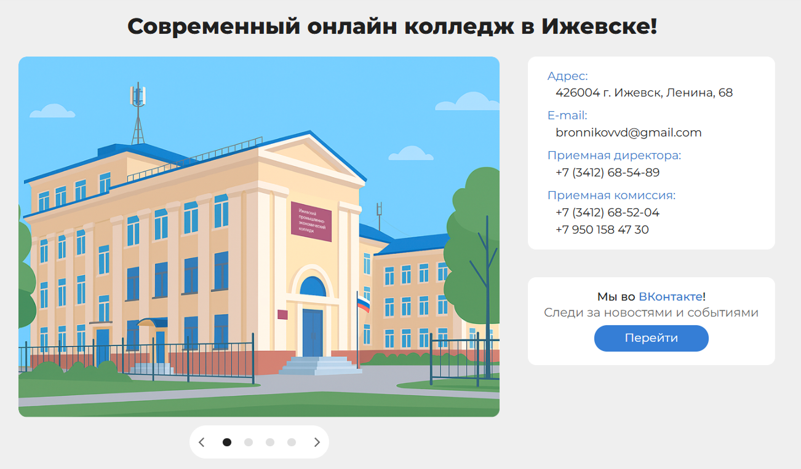
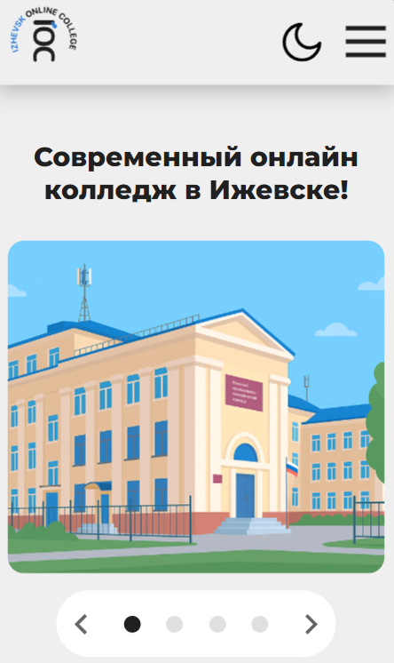
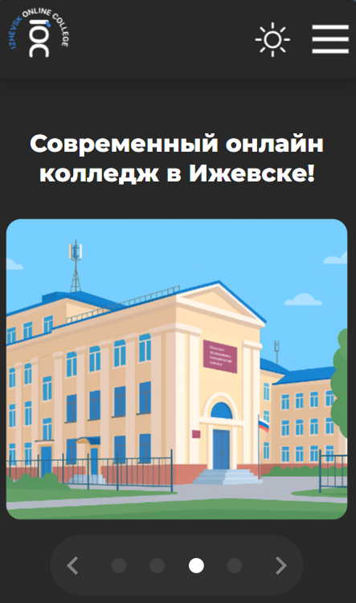
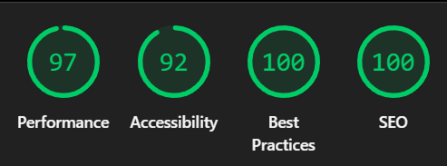

# IOC — Izhevsk Online College

**🔗 Демо:** [wildkodokushi.github.io/IOC-Izhevsk-Online-College](https://wildkodokushi.github.io/IOC-Izhevsk-Online-College/)

  
  

## О проекте

Изначально сайт создавался для нашего колледжа, но предложенный вариант не был принят. Поэтому я решил превратить работу в полноценный **SEO-проект**: пройти путь от анализа и подбора запросов до готового, проиндексированного и измеримого сайта.

Работа шла в таком порядке:

1. Анализ ниши и конкурентов.
2. Подбор ключевых слов и поисковых запросов.
3. Вёрстка с учётом семантики и логики страниц.
4. Проработка целевого действия (что должен сделать посетитель на сайте).
5. Сборка карты сайта (`sitemap.xml`).
6. Настройка `robots.txt` для корректной индексации.
7. Внедрение Яндекс.Метрики и подтверждение сайта в Яндекс.Вебмастере.

## Что сделано

- изображения в формате WebP и ленивая загрузка (`loading="lazy"`);
- шрифты в современном формате WOFF2;
- критические стили (inline CSS для первого экрана) на страницах, где это даёт выигрыш;
- модульная организация стилей;
- слайдер на Swiper.js, переключатель тёмной темы и мобильное бургер-меню;
- семантическая и адаптивная вёрстка;
- мета-теги, Open Graph, заголовки, `alt` у картинок;
- `sitemap.xml`, `robots.txt`, подтверждение в Яндекс.Вебмастере;
- страница 404;
- оптимизация шрифтов и изображений.

## Результаты

Замеры Lighthouse:

| Performance | Accessibility | Best Practices | SEO |
|:-----------:|:-------------:|:--------------:|:---:|
| **97** | **92** | **100** | **100** |

## Стек

- HTML5
- CSS3
- JavaScript (без фреймворков)
- Swiper.js — слайдер
- GitHub Pages, Vercel — хостинг
- Яндекс.Метрика, Яндекс.Вебмастер — аналитика и индексация

## Авторы

- **vhsuck** — Дизайнер 
[GitHub](https://github.com/vhsuck)
- **devnyash** — Backend
[GitHub](https://github.com/devnyash)
- **Я** — Frontend, SEO

## Лицензия

Проект распространяется под лицензией [MIT](LICENSE).

Логотип, иллюстрации и тексты принадлежат Ижевскому промышленному экономическому колледжу и не входят в лицензию MIT.